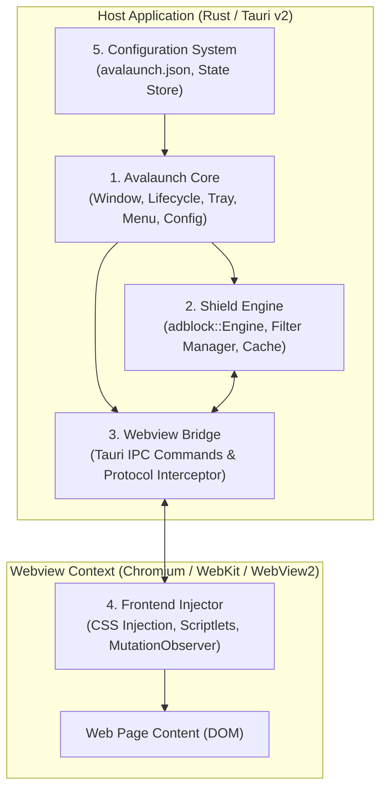
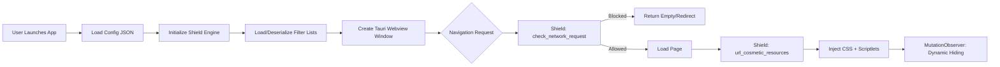

# Avalaunch System Architecture

This document describes the high-level architecture, subsystem boundaries, data flow, ad-blocking engine mechanics, key interfaces, and repository layout for **Avalaunch**.

---

## Architecture Decision: Build from Scratch

Avalaunch is built from scratch on **Tauri v2.10+**, rather than forking existing wrapper utilities such as [Pake](https://github.com/tw93/Pake).

### Rationales

1. **Permissive Licensing**:
   - Pake is licensed under **GPL-3.0** (a viral copyleft license).
   - Avalaunch targets permissive dual-licensing (**MIT / Apache-2.0**), allowing flexible distribution and commercial/enterprise integration.
2. **First-Class Interception Architecture**:
   - Pake is designed as a lightweight, thin webview wrapper around remote URLs without native network interception hooks.
   - Avalaunch's core differentiator is integrated ad and tracker blocking via native Rust middleware, which requires low-level webview interception (`wry` / platform webview hooks) and custom IPC bridges.
3. **Extensible Security & Privacy Middleware**:
   - A purpose-built architecture allows deep integration of `adblock-rust`, custom filter lists, scriptlet injection, CSP enforcement, and local serialized rule caching.
4. **Pattern Adoption without Fork Burden**:
   - While built from scratch, Avalaunch adopts proven architectural patterns from Pake:
     - Declarative JSON configuration files (`avalaunch.json`)
     - Persistent window geometry and state storage
     - System tray integration and menu shortcuts
     - Per-domain custom User-Agent spoofing

---

## System Overview

Avalaunch decomposes into five primary components:



### 1. Avalaunch Core (Rust / Tauri)
- **Application Shell**: Manages the native OS application lifecycle, events, single-instance lock, system tray, window creation, and geometry persistence.
- **Runtime Environment**: Initializes Tauri runtime plugins, native menus, global keyboard accelerators, and platform-specific User-Agent overrides.

### 2. Shield Engine (Rust)
- **High-Performance Rule Engine**: Encapsulates Brave's `adblock` crate (v0.13+), compiled with native regex optimization.
- **Network Request Filtering**: Evaluates URLs, source domains, and request types (script, image, subdocument, stylesheet, xhr/fetch) against rule sets via `Engine::check_network_request()`.
- **Cosmetic Rule Matching**: Resolves hostname-specific CSS selectors, class/ID hiding rules, and scriptlets via `Engine::url_cosmetic_resources()` and `Engine::hidden_class_id_selectors()`.
- **Filter List Lifecycle**: Downloads, parses, updates, and persists standard lists (EasyList, EasyPrivacy) and custom ABP/uBlock rules.
- **Fast Startup Serialization**: Deserializes pre-compiled engine bytecode cache for instantaneous cold-boot filtering.

### 3. Webview Bridge (Rust ↔ JS)
- **IPC Interface**: Exposes strongly-typed Tauri commands for dynamic selector matching, stats aggregation, and rule management.
- **Low-Level Protocol / WebResource Hooking**: Intercepts HTTP/HTTPS requests at the webview level before network dispatch.
- **Scriptlet & Style Injector**: Injects initialization scripts, anti-circumvention scriptlets, and CSS rules into web frames before DOM rendering (`initialization_script`).

### 4. Frontend Injector (JavaScript / TypeScript)
- **Cosmetic CSS Injection**: Injects computed selector rules (`display: none !important;`) to collapse ad containers.
- **Dynamic MutationObserver**: Scans dynamically added DOM nodes against active class and ID rules without blocking main thread responsiveness.
- **Runtime Scriptlets**: Executes isolated helper functions (e.g., `abort-current-inline-script`, `set-constant`) to neutralize inline ad scripts.

### 5. Configuration System (JSON)
- **Declarative Manifest**: Reads `avalaunch.json` defining target URL, window dimensions, title bar customizations, proxy settings, and Shield configuration.
- **State Storage**: Persists user runtime preferences, window position/size, and filter list update timestamps across sessions.

---

## Component Responsibilities

| Component | Responsibility | Tech / Crates | Primary Interfaces |
|---|---|---|---|
| **Avalaunch Core** | Windowing, app lifecycle, native menus, tray | `tauri`, `tauri-plugin-window-state` | `tauri::Builder`, `tauri::App` |
| **Shield Engine** | Rule compilation, request matching, cosmetic resolution | `adblock` (0.13+), `serde`, `tokio` | `ShieldEngine`, `FilterListManager` |
| **Webview Bridge** | IPC routing, request interception, script injection | `tauri::command`, `wry` (WebResourceRequested) | `check_url`, `get_cosmetic_resources` |
| **Frontend Injector** | Dynamic DOM hiding, scriptlet execution | TypeScript, `MutationObserver` | `cosmetic-injector.ts`, `service-worker.ts` |
| **Configuration System** | App settings deserialization, state caching | `serde_json`, `directories` | `AppConfig`, `ShieldConfig` |

---

## Ad-Blocking Strategy (Hybrid Approach)

Avalaunch employs a 3-layer defense-in-depth architecture to maximize ad blocking efficiency while minimizing page breakage and performance overhead.

```
Layer 1: Network-Level Blocking (Primary)
├── wry-level WebResourceRequested handler (Windows / WebView2)
├── WebKitGTK request interception (Linux)
├── WKWebView content rules (macOS)
└── Tauri custom protocol proxy (fallback)

Layer 2: Cosmetic Filtering (Secondary)
├── CSS injection: hide_selectors → { display: none !important; }
├── Scriptlet injection: injected_script from url_cosmetic_resources()
└── MutationObserver: dynamic class/id → hidden_class_id_selectors()

Layer 3: DNS/CSP Hardening (Future Roadmap)
├── CSP header injection via on_web_resource_request
└── Configurable DNS-over-HTTPS (DoH) resolver
```

### Layer 1: Network-Level Interception
1. Requests triggered by the webview (images, tracking pixels, scripts, ad iframes) are intercepted by the platform-specific native handler.
2. The URL, initiator origin, and resource type are converted into `adblock::request::Request`.
3. `ShieldEngine::check_request()` evaluates rules.
4. If blocked, the interceptor short-circuits the request and returns an empty HTTP 200/204 or aborts the connection.

### Layer 2: Cosmetic & Dynamic DOM Filtering
1. When a page starts loading, `get_cosmetic_resources(url)` computes matching CSS hiding rules and generic selectors for that domain.
2. Static CSS is immediately injected via the webview styling API before paint.
3. Injected `MutationObserver` monitors DOM mutations. When elements with specific classes or IDs appear, it queries `hidden_class_id_selectors()` or matches against cached selector tables, instantly applying inline hidden styles.
4. Scriptlets run in isolated world context to neuter tracking APIs (e.g. `google-analytics`, `window.ga`, `fingerprint` scripts).

---

## Data Flow

The following sequence illustrates application startup, network request interception, and cosmetic filtering:



---

## Directory Structure

The project follows a standard Tauri v2 multi-crate and frontend workspace structure:

```
avalaunch/
├── AGENTS.md                          (Agent operating contract & guidelines)
├── README.md                          (Project overview and quickstart)
├── Cargo.toml                         (Workspace root configuration)
├── docs/
│   ├── index.md                       (Documentation navigation hub)
│   ├── architecture.md                (This architecture specification)
│   ├── techstack.md                   (Technology stack & versions)
│   ├── current-sprint.md              (Living sprint document)
│   └── decisions/                     (Architecture Decision Records)
│       └── 001-build-from-scratch.md  (ADR: Why Tauri v2 from scratch vs Pake)
├── src-tauri/
│   ├── Cargo.toml                     (Tauri application crate)
│   ├── tauri.conf.json                (Tauri build & runtime configuration)
│   ├── avalaunch.json                 (App config manifest, similar to pake.json)
│   ├── capabilities/                  (Tauri v2 security permissions & capabilities)
│   │   └── default.json
│   ├── icons/                         (Application icons)
│   ├── resources/                     (Bundled filter lists & default assets)
│   │   ├── easylist.txt
│   │   └── easyprivacy.txt
│   └── src/
│       ├── main.rs                    (Application binary entry point)
│       ├── lib.rs                     (Tauri app builder & plugin orchestration)
│       ├── config.rs                  (JSON config loading & validation)
│       ├── shield/                    (Ad-blocking engine module)
│       │   ├── mod.rs                 (Module exports)
│       │   ├── engine.rs              (adblock::Engine wrapper & lifecycle)
│       │   ├── filter_lists.rs        (List downloading, caching, & parsing)
│       │   ├── cosmetic.rs            (CSS & scriptlet injection logic)
│       │   └── interceptor.rs         (Network request interception handlers)
│       └── commands.rs                (Tauri IPC commands exposed to webview)
├── src/                               (Frontend JavaScript/TypeScript)
│   ├── main.ts                        (Frontend runtime initialization)
│   ├── cosmetic-injector.ts           (MutationObserver & CSS injection script)
│   └── service-worker.ts             (Fetch/XHR fallback interception)
├── package.json                       (Frontend tooling & dependencies)
└── index.html                         (Webview shell fallback entry point)
```

---

## Key Interfaces

### 1. Shield Engine (Rust Backend)

```rust
use adblock::lists::{FilterFormat, FilterSet};
use adblock::Engine;

pub struct ShieldEngine {
    engine: Engine,
    stats: ShieldStats,
}

pub struct BlockResult {
    pub matched: bool,
    pub filter: Option<String>,
    pub redirect_url: Option<String>,
}

pub struct CosmeticResources {
    pub hide_selectors: Vec<String>,
    pub injected_script: String,
    pub generics: bool,
}

impl ShieldEngine {
    /// Initialize the engine with parsed or cached filter lists.
    pub fn init_engine(filter_lists: Vec<FilterListConfig>) -> Result<Self, ShieldError>;

    /// Check whether a network request should be blocked, allowed, or redirected.
    pub fn check_request(&self, url: &str, source_url: &str, request_type: &str) -> BlockResult;

    /// Retrieve domain-specific cosmetic stylesheets and scriptlets for a page.
    pub fn get_cosmetic_resources(&self, page_url: &str) -> CosmeticResources;

    /// Extract hidden selectors matching dynamically discovered class/id names.
    pub fn get_hidden_selectors(&self, classes: &[String], ids: &[String], exceptions: &[String]) -> Vec<String>;
}
```

### 2. Tauri IPC Commands

```rust
#[tauri::command]
pub async fn check_url(
    state: tauri::State<'_, Arc<ShieldEngine>>,
    url: String,
    source_url: String,
    request_type: String,
) -> Result<BlockResult, String>;

#[tauri::command]
pub async fn get_cosmetic_resources(
    state: tauri::State<'_, Arc<ShieldEngine>>,
    page_url: String,
) -> Result<CosmeticResources, String>;

#[tauri::command]
pub async fn get_hidden_selectors(
    state: tauri::State<'_, Arc<ShieldEngine>>,
    classes: Vec<String>,
    ids: Vec<String>,
    exceptions: Vec<String>,
) -> Result<Vec<String>, String>;

#[tauri::command]
pub async fn update_filter_lists(
    state: tauri::State<'_, Arc<ShieldEngine>>,
) -> Result<FilterUpdateReport, String>;

#[tauri::command]
pub async fn get_blocking_stats(
    state: tauri::State<'_, Arc<ShieldEngine>>,
) -> Result<ShieldStats, String>;
```

### 3. Application Configuration (`avalaunch.json`)

```json
{
  "$schema": "./schema/avalaunch.schema.json",
  "name": "Avalaunch",
  "url": "https://example.com",
  "window": {
    "width": 1200,
    "height": 780,
    "min_width": 400,
    "min_height": 300,
    "resizable": true,
    "fullscreen": false,
    "title_bar": false,
    "transparent": false
  },
  "shield": {
    "enabled": true,
    "filter_lists": [
      "easylist",
      "easyprivacy"
    ],
    "custom_filter_urls": [],
    "cosmetic_filtering": true,
    "scriptlets_enabled": true,
    "custom_rules": []
  },
  "user_agent": {
    "override": null,
    "append_app_name": true
  }
}
```

---

## Related Documents

- [Documentation Navigation Hub](index.md)
- [Technology Stack & Dependency Versions](techstack.md)
- [ADR 001: Build from Scratch vs Forking Pake](decisions/001-build-from-scratch.md)
- [Agent Operating Contract](../AGENTS.md)
